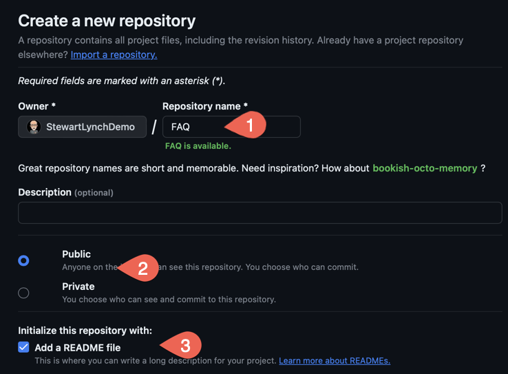
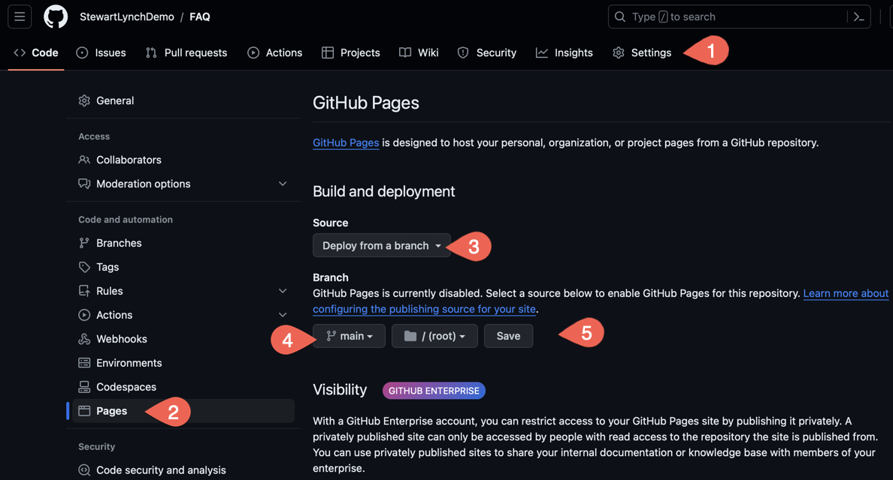
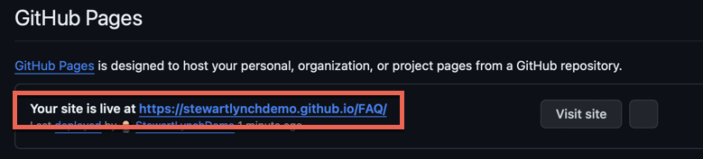
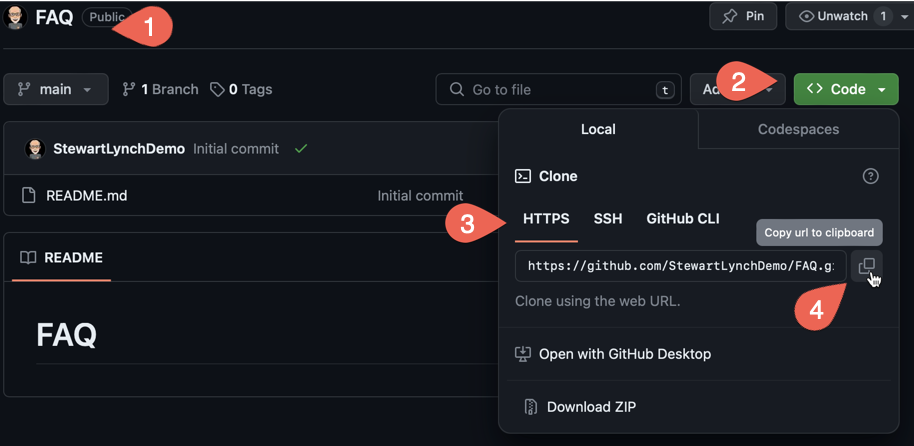
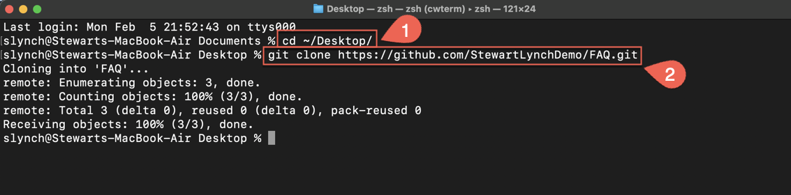
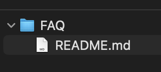
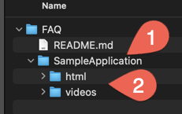

## Pages Account

1. Log in to StewartLynchDemo
   1. Create new GitHub Repo called FAQ
   2. Talk about Public or Private
   3. Add README



2. Enable Pages

   1. Click on the Settings Menu

   2. Click on Pages on the left side bar

   3. For the source, choose **Display from a branch**

   4. Choose the **main** branch and leave it at */(root)*

   5. Click on **Save**

   That root directory is where you will store your JSON file and related content for each one of your applications.



3. Shortly after saving (you may have to refresh your browser) the site will be deployed and you will see your url



4. Copy this URL as this will form part of the base url for every one of your applications where you will be be implementing FAQs

```swift
https://stewartlynchdemo.github.io/FAQ/
```

## Cloning the Repository

Once your pages account has been set up, you need to Clone it to your own computer so you can add the JSON and related files to a folder that you will create within the FAQ folder that will represent your application

1. In your FAQ Repository

   1. Return to the root of your repository

   2. Click on the **Code** button

   3. Choose the **HTTPS** tab

   4. Copy the URL to the clipboard

You can now exit and leave GitHub



2. You will need to find clone the repository to some location on your computer.  I have a single folder where I clone all of my GitHub repositories to but for the sake of this video, I am going to clone to the desktop

3. Open a Terminal Application

   1. CD to the Desktop
   2. Enter the command `git clone` followed by a `space` and then paste in the URL that you copied from your GitHub repository and press <Return>

   

This will clone the repository to your desktop and inside you will see the README file



4. Inside the FAQ folder, create a new folder to represent your application

   1. Create use a name with no spaces

   2. Open that folder and create two new folders

      1. One named **html**
      2. A second named **videos**

      

> This folder structure will be the same for all of your applications.

The next step is to use **FAQ JSONGenerator** to create and generate your FAQ JSON file that will be stored in the application folder at the same level as the html and videos folders.