## FAQ JSON Generator

To create the FAQ JSON, I have created a pretty basic Mac application and you can either download the compiled application or you can clone the source code and compile it yourself.

Links to both are in the description.

### DMG File

If you download and expand the completed DMG File, all you have to do is drag and drop the application in to your applications folder

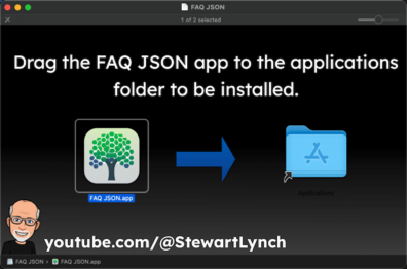

### Source Code

If you are cloning and running from the source code, please be kind as this is basically one of my first Mac applications, I am still very much an iOS developer so I may not be following the Human Interface Guidelines for a Mac app. 

### Getting Started

When you launch the app, you are prompted to add your first application.  This means that you need to add a record for the application to which you want to add the FAQs to.  We do not have an app yet, but will get to that shortly.  

1. Create a new record by either tapping on the '+' button or choosing "New Application..." From the File menu. (⌘ ⇧ N)

2. Enter the App Name is the same as your app name.  This is not used in the JSON, but rather is just a name for you to identify your app by.  Use **Sample Application** Note that I am using a space here for my app name and it is just a reference.  When we export the JSON the spaces will be removed and it will match the folder name we created in our FAQ folder

   

### Creating FAQs

Select your application in the list and you are now ready to start creating new FAQs for this application.

The FAQs should represent the kind of questions you users have or ones that you would anticipate they would have.  For the purposes of this demo, we will just create a number of FAQs to demonstrate the 4 different types that you can create

##### Question/Answer FAQ

The first type is a QuestionAnswer FAQ and is the default.  To create a new FAQ, you can either tap on the "+" button on the right panel or choose **New FAQ** from the **FAQs** menu (⌘ N)

1. Enter the text for the question
2. And follow that with the text for the answer
3. The level will determine how your FAQs are presented.  If you have different levels, they will be presented in groups by level.  The default is level 1 and you can have up to 5 different levels.  Leave this one as level 1
4. This is a simple FAQ with no links, so the link type is **none**

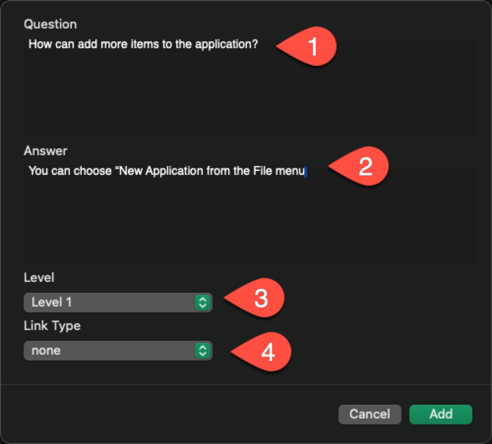

#### Editing FAQs

Once an FAQ has been created, selecting it will present it in the right hand side where you can make changes and update those changes.

#### Deleting and FAQ

To delete an FAQ, select it and either tap on the trash can icon that appears on the toolbar in the right pane or choose **Delete FAQ** from the **FAQs** menu (⌘ D)

#### Other FAQ types

There are four other FAQ types and each one will create a link button to show more information about the FAQ.

##### External Link

1. The Question and Answer sections are the same
2. The Link Type must be set to **External Link**
3. The title will be the label used on the button
4. The URL is the full url to the web site.

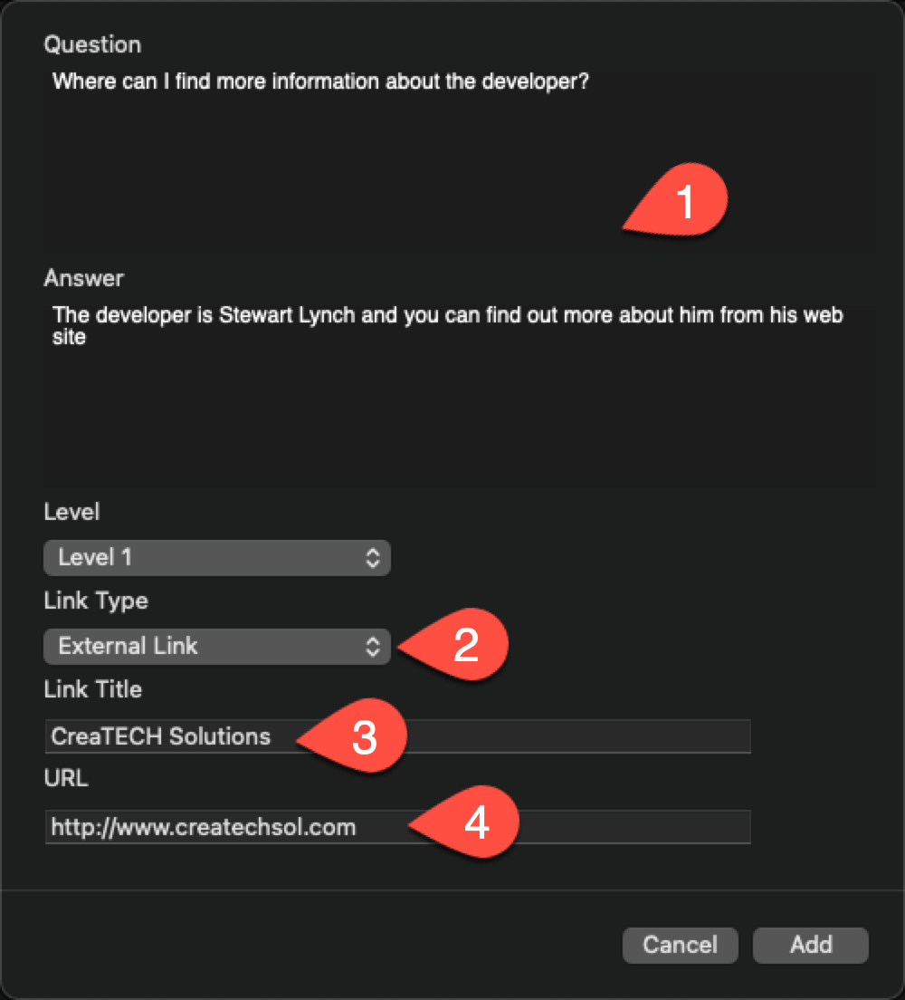

##### Local Video

A local video is a video that you can upload to the **media** folder in the GitHub repository.  There is an example video provided with the resources for this tutorial called  **showRoute.mp4** and you can you can copy it to the **FAQ/SampleApplication/Media** folder.  When you create a new FAQ of this type, you create a question and answer as always but

1. Choose **Local Video** as the link type
2. Enter any string for the title and this will be the label for the link button
3. Enter the video name with extension in the **Video File Name** field

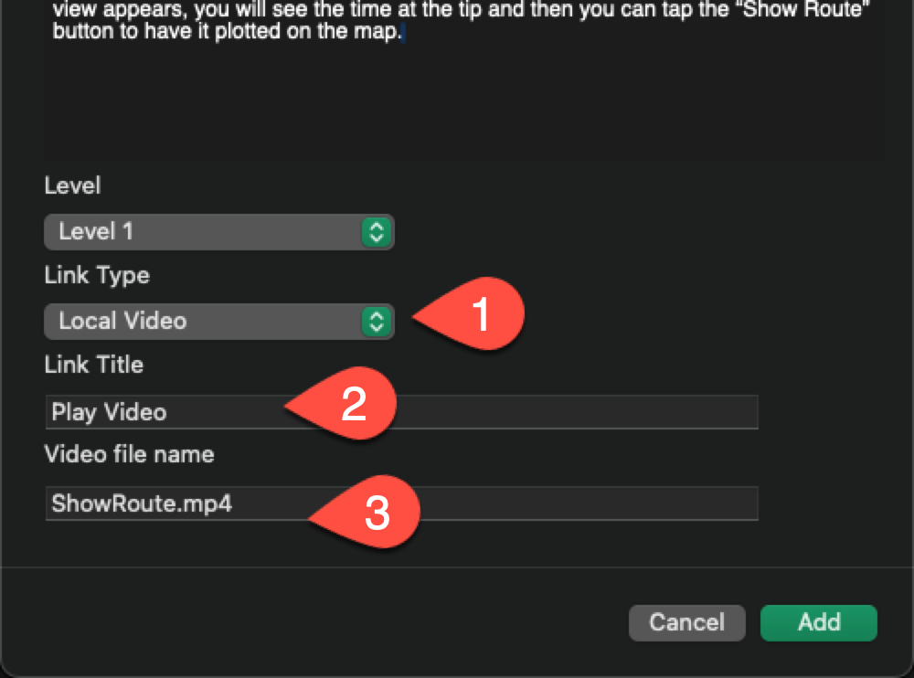

##### Local Image

The local image link type is just like a local video type.  You add an image to the application's FAQ media folder and enter a question, answer, along with a link title to be used as the button label and then enter the name of the image in the Image file name field.

You can use the sample DevDesktop.jpeg file to create one of these FAQs.  Again, enter a question and answer 

1. Choose **Local Image** as the link 
2. Enter any string for the title and this will be the label for the link button
3. Enter the image name with extension in the **Image file name** field

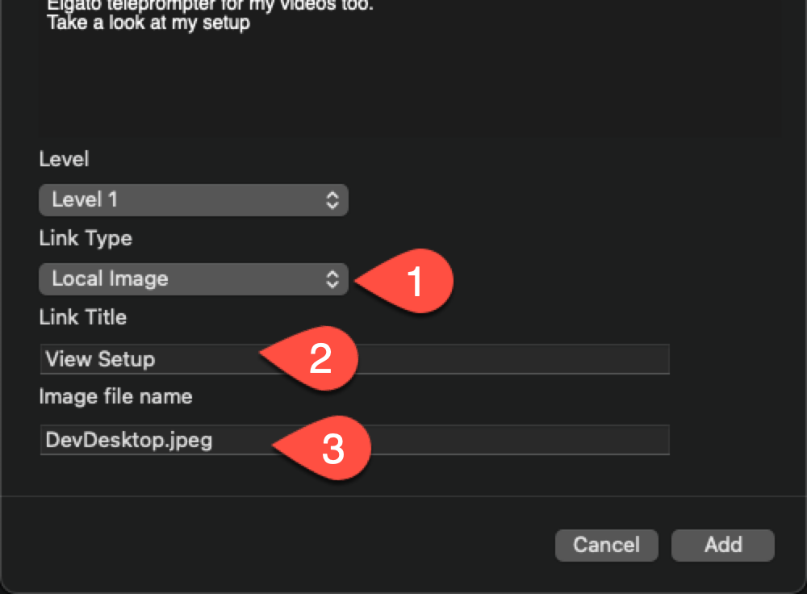

##### Local Link

The local link type is for providing access to html content that you have stored in the application's FAQ folder's html folder.

There are two types.  

##### Simple html

A simple html page is one that contains no images.  For this you can simply drag the file into the html folder and use the full name for the html as the html file path name

As an example, I have provided a **Sample.html** file that can be copied into the **html** folder in the SampleApplication folder

1. Choose **Local Link** as the link 
2. Enter any string for the title and this will be the label for the link button
3. Enter the name of the html file including the extension

**HTML Folder**

If you have a page that contains images, you will need to create a Folder in the html folder that will contain not only the html page but also the images.

> Note: all images must be contained within the parent folder with appropriate links AND the page html page must be titled index.html or some other version of the default index page that browsers will display as the default.

As an example, I have provided a folder titled **FolderHTML** file that can be copied into the **html** folder in the SampleApplication folder

1. Choose **Local Link** as the link 
2. Enter any string for the title and this will be the label for the link button
3. Enter the name of the **Folder**

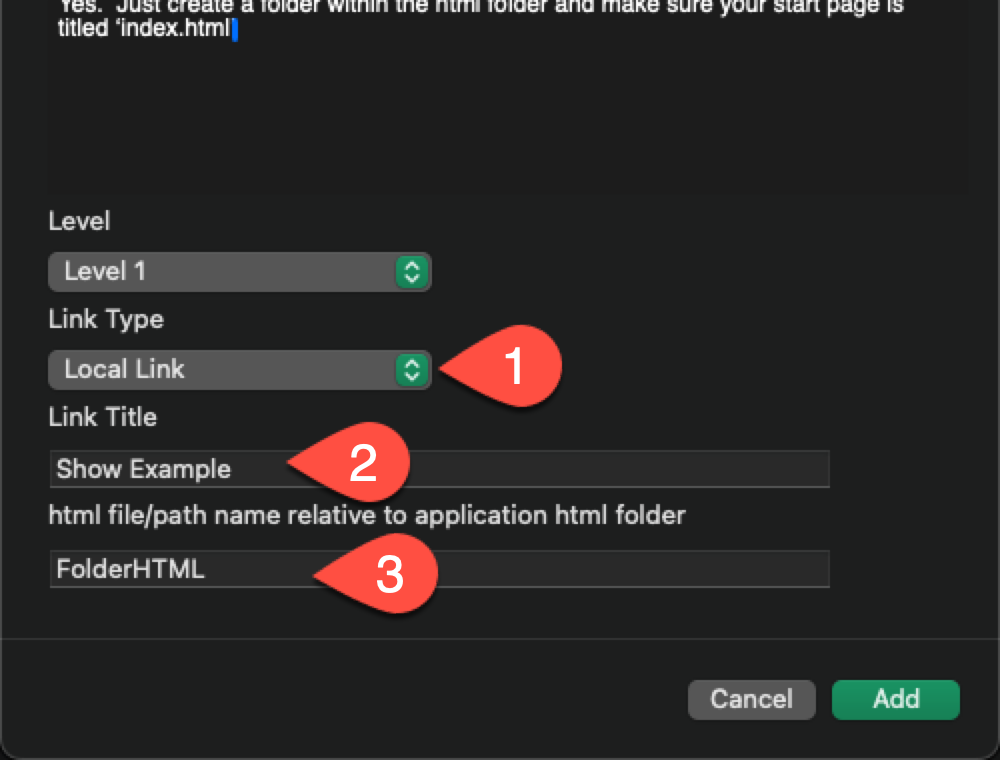

### Changing the FAQ Sort Order

You can rearrange an FAQ in the list simply by dragging and dropping to a different location.

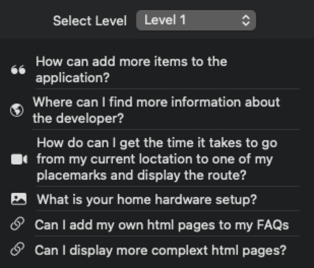

### Importing FAQs

You may have some FAQs that you want to include with all of your applications so you can import them from a set that was created for another application.

1. Choose the application you want to import into.

2. Choose **Import JSON** from the file menu

3. Choose either Append or Replace

   1. Append will add the FAQs to the set
   2. Replace will delete all existing ones and replace them with the set being imported

   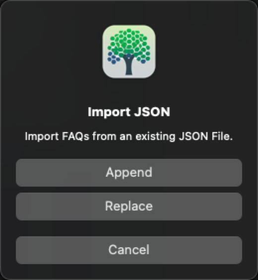

As an example, you can import the **Miscellaneous.json** faqs from the tutorial resources.

**Make sure you choose append.**

At first glance after importing, you may find that the list of FAQs has not changed.

However, if you choose the selected level you will see that there are two levels now and the second level shows the two that are imported.

They were imported into level 2 because that is what they were exported as.

You can choose either one of them and change the level as you see fit.

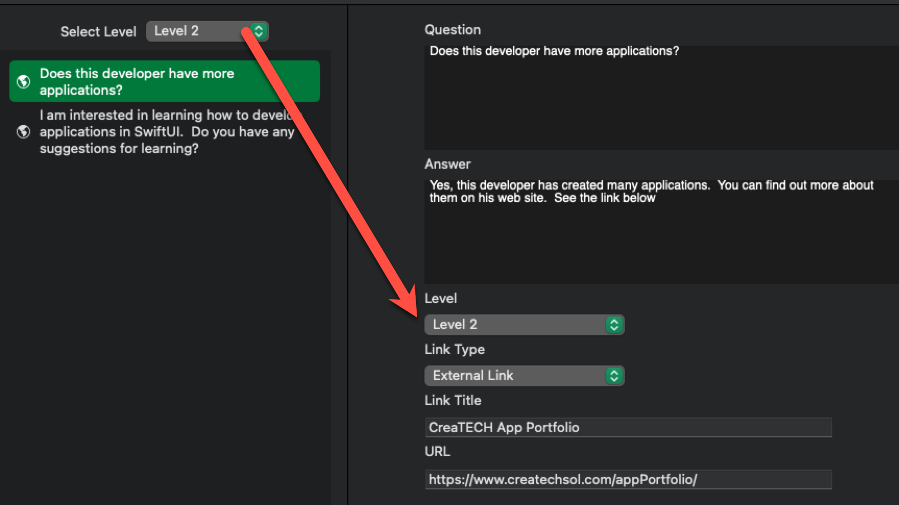

### Exporting JSON

Once you have your JSON completed, you can export it for use in your applications.

1. Select the application and Choose **Export JSON** from the File menu.
2. Notice that despite the fact that the app name was Example Application with a space, the default name is changed to **ExampleApplication.json** without a space.  You can choose to rename it anything you like, but always make sure it contains no spaces or special characters.
3. Save it to the root level of your application folder in the FAQ folder for GitHub

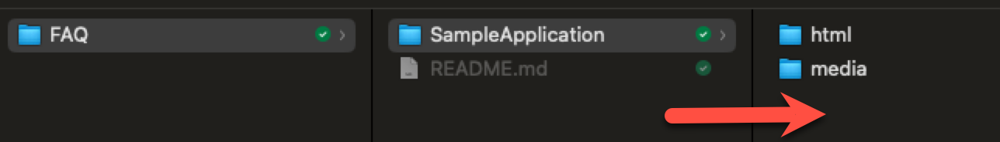

The final result for all of the FAQ content for this Sample Application is as shown

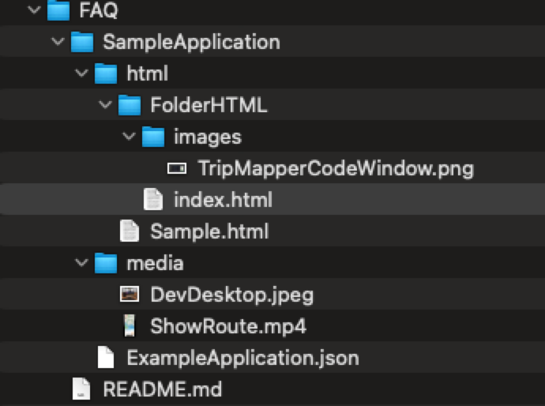

> Note that the folder name and the json name are different, this is not necessarily an issue, but it might be better in the future to use the same name for the export as for the folder name as it will be easier to remember.

## Pushing to GitHub

The final thing you need to do before adding to your Application is to push the content up to GitHub.

Open the Terminal App

1. cd to the location where you have cloned your FAQ folder
2. Add all files using the `git add .` command
3. Commit the files using a commit with a message `git commit -m '<your message>'`

4. Once committed push up to you remote repository with `git push`

All of your files will now be up on GitHub and in particular, the json file will be available through the pages source.

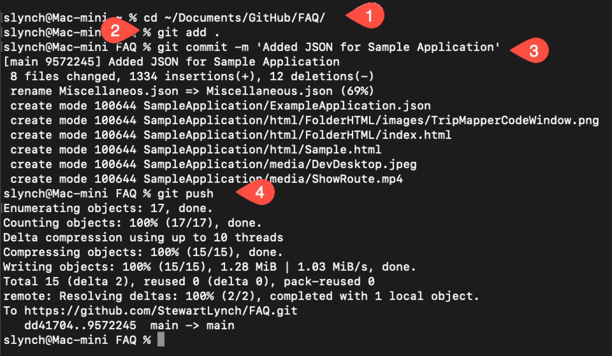

> Note: Every time you update your FAQs you can issue the same commands on the root FAQ folder.  It may take Pages a minute or so to  make the updates available and your app may have cached the former url if this is an update so it may take several minutes for your app to recognize the changes.