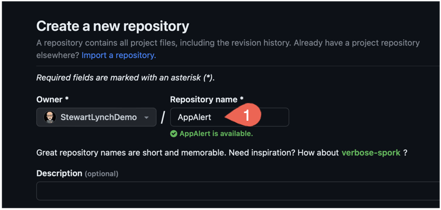

# Application FAQs

## GitHub Pages

GitHub Pages is a static site hosting service that takes HTML, CSS, and JavaScript files straight from a repository on GitHub and publishes a website.

GitHub Pages is available in public repositories with GitHub Free and in public **and** private repositories with GitHub Pro so there is no cost to you to do this if you want to use a public repository.

The only requirement is that you have a GitHub account.  Since it is now free for unlimited public and private repositories, there is no financial barrier.

You can find out more about GitHub Pages at this link

https://docs.github.com/en/pages/getting-started-with-github-pages/configuring-a-publishing-source-for-your-github-pages-site

Let's step through the process of creating a repository that will act as our GitHub pages source for all of your application FAQz

First, log in to your GitHub account.

1. Once you have your account, and are logged in, create a new repository and call it FAQ.  

   

   

2. Add a README file

3. Setup Pages

4. Clone repo to your computer

5. Create folder structure

6. For each app, create a folder using the app name and inside there place your json file along with to other folders; one named videos and the other, html

   The structure should like like this:

   

   The **videos** folder should contain just videos that are referenced by name only when the **LinkType** is **.video**

   The **html** folder can contain single html files that can be referenced by name alone in the url field OR you can create a sub folder within there but that folder must have a root **index.html** file so you then reference the site using just the folder name in the url field for a **weblink** type of **LinkType**.

   For each implementation, the url will be 

   BaseURL for the FAQ JSONGenerator app will be your pages url followed by the app folder name

   ```swift
   https://stewartlynch.github.io/FAQ/<AppName>/
   ```

   ```swift
   https://stewartlynch.github.io/FAQ/<AppName>/<JSON File> 
   ex
   https://stewartlynch.github.io/FAQ/TripMapper/TripMapper.json
   ```

   

   Each time you update the contents of this folder do the following:

   ```swift
   git add .
   git commit -m 'Updating json for app'
   git push
   ```

   In the Application, you create an instance of the FAQService by passing in the link